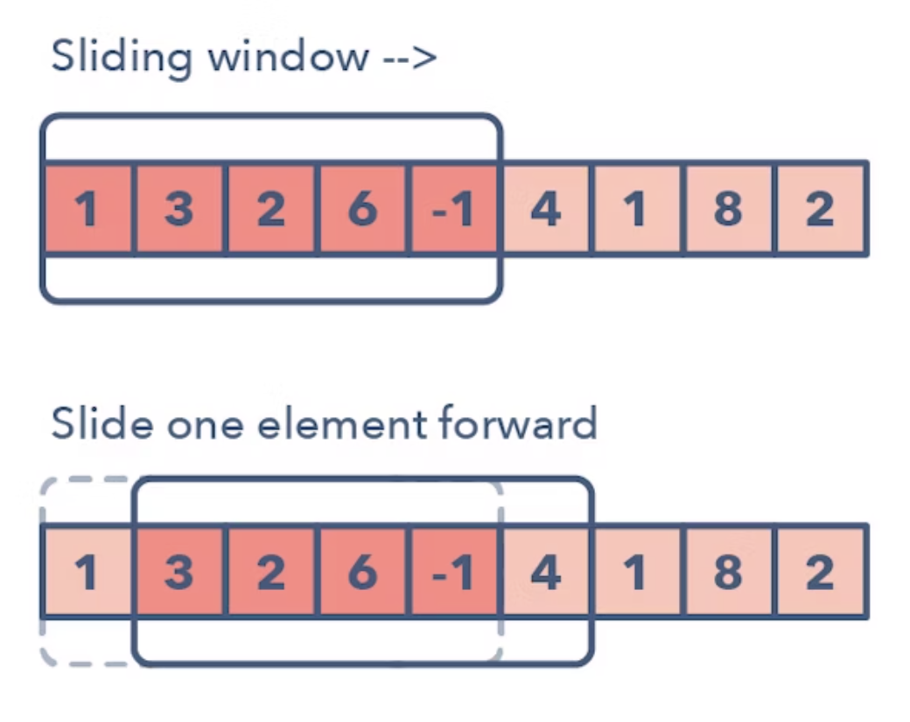
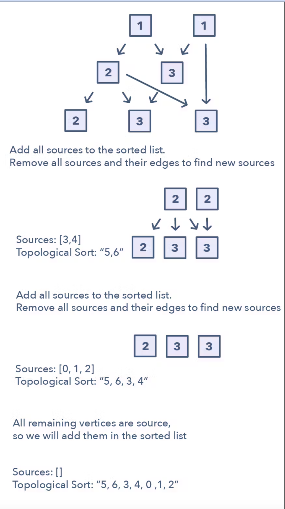

- [Introduction](#introduction)
- [Problems and Solutions](#problems-and-solutions)
- [15 Patterns to Ace Any Coding Interview Question](#15-patterns-to-ace-any-coding-interview-question)
    - [1. Sliding Window](#1-sliding-window)
    - [2. Two Pointers or Iterators](#2-two-pointers-or-iterators)
    - [3. Fast and Slow Pointers](#3-fast-and-slow-pointers)
    - [4. Merge Intervals](#4-merge-intervals)
    - [5. Cyclic Sort](#5-cyclic-sort)
    - [6. In-place Reversal of a LinkedList](#6-in-place-reversal-of-a-linkedlist)
    - [7. Tree Breadth First Search (BFS)](#7-tree-breadth-first-search-bfs)
    - [8. Tree Depth First Search (DFS)](#8-tree-depth-first-search-dfs)
    - [9. Two Heaps](#9-two-heaps)
    - [10. Subsets](#10-subsets)
    - [11. Modified Binary Search](#11-modified-binary-search)
    - [12. Top K Elements](#12-top-k-elements)
    - [13. K-way Merge](#13-k-way-merge)
    - [14. 0/1 Knapsack](#14-01-knapsack)
    - [15. Topological Sort](#15-topological-sort)
- [Main Algorithms to Know and Remember](#main-algorithms-to-know-and-remember)
- [Contributing](#contributing)
- [License](#license)

## Introduction

In this repository, you will find a collection of JavaScript interview questions \ algorithms along with their solutions. The goal is to help developers prepare for technical interviews by providing clear and concise explanations and code examples.

## Problems and Solutions

Each problem in this repository includes:
- A detailed description of the problem
- A step-by-step solution in JavaScript

## 15 Patterns to Ace Any Coding Interview Question

### 1. Sliding Window
1. Sliding Window

The Sliding Window pattern is used to perform a required operation on a specific window size of a given array or linked list, such as finding the longest subarray containing all 1s. Sliding Windows start from the 1st element and keep shifting right by one element and adjust the length of the window according to the problem that you are solving. In some cases, the window size remains constant and in other cases the sizes grows or shrinks.

Following are some ways you can identify that the given problem might require a sliding window:

The problem input is a linear data structure such as a linked list, array, or string
You’re asked to find the longest/shortest substring, subarray, or a desired value
Common problems you use the sliding window pattern with:

Maximum sum subarray of size ‘K’ (easy)
Longest substring with ‘K’ distinct characters (medium)
String anagrams (hard)

### 2. Two Pointers or Iterators

Two Pointers is a pattern where two pointers iterate through the data structure in tandem until one or both of the pointers hit a certain condition.Two Pointers is often useful when searching pairs in a sorted array or linked list; for example, when you have to compare each element of an array to its other elements.

Two pointers are needed because with just pointer, you would have to continually loop back through the array to find the answer. This back and forth with a single iterator is inefficient for time and space complexity — a concept referred to as asymptotic analysis. While the brute force or naive solution with 1 pointer would work, it will produce something along the lines of O(n²). In many cases, two pointers can help you find a solution with better space or runtime complexity.

Ways to identify when to use the Two Pointer method:

It will feature problems where you deal with sorted arrays (or Linked Lists) and need to find a set of elements that fulfill certain constraints
The set of elements in the array is a pair, a triplet, or even a subarray
Here are some problems that feature the Two Pointer pattern:

Squaring a sorted array (easy)
Triplets that sum to zero (medium)
Comparing strings that contain backspaces (medium)

### 3. Fast and Slow Pointers

The Fast and Slow pointer approach, also known as the Hare & Tortoise algorithm, is a pointer algorithm that uses two pointers which move through the array (or sequence/linked list) at different speeds. This approach is quite useful when dealing with cyclic linked lists or arrays.

By moving at different speeds (say, in a cyclic linked list), the algorithm proves that the two pointers are bound to meet. The fast pointer should catch the slow pointer once both the pointers are in a cyclic loop.

ow do you identify when to use the Fast and Slow pattern?

The problem will deal with a loop in a linked list or array
When you need to know the position of a certain element or the overall length of the linked list.
When should I use it over the Two Pointer method mentioned above?

There are some cases where you shouldn’t use the Two Pointer approach such as in a singly linked list where you can’t move in a backwards direction. An example of when to use the Fast and Slow pattern is when you’re trying to determine if a linked list is a palindrome.
Problems featuring the fast and slow pointers pattern:

Linked List Cycle (easy)
Palindrome Linked List (medium)
Cycle in a Circular Array (hard)

### 4. Merge Intervals

The Merge Intervals pattern is an efficient technique to deal with overlapping intervals. In a lot of problems involving intervals, you either need to find overlapping intervals or merge intervals if they overlap. The pattern works like this:

Given two intervals (‘a’ and ‘b’), there will be six different ways the two intervals can relate to each other:

Understanding and recognizing these six cases will help you help you solve a wide range of problems from inserting intervals to optimizing interval merges.

How do you identify when to use the Merge Intervals pattern?

If you’re asked to produce a list with only mutually exclusive intervals
If you hear the term “overlapping intervals”.
Merge interval problem patterns:

Intervals Intersection (medium)
Maximum CPU Load (hard)

### 5. Cyclic Sort

This pattern describes an interesting approach to deal with problems involving arrays containing numbers in a given range. The Cyclic Sort pattern iterates over the array one number at a time, and if the current number you are iterating is not at the correct index, you swap it with the number at its correct index. You could try placing the number in its correct index, but this will produce a complexity of O(n^2) which is not optimal, hence the Cyclic Sort pattern.

How do I identify this pattern?

They will be problems involving a sorted array with numbers in a given range
If the problem asks you to find the missing/duplicate/smallest number in an sorted/rotated array
Problems featuring cyclic sort pattern:

Find the Missing Number (easy)
Find the Smallest Missing Positive Number (medium)

### 6. In-place Reversal of a LinkedList

In a lot of problems, you may be asked to reverse the links between a set of nodes of a linked list. Often, the constraint is that you need to do this in-place, i.e., using the existing node objects and without using extra memory. This is where the above mentioned pattern is useful.

This pattern reverses one node at a time starting with one variable (current) pointing to the head of the linked list, and one variable (previous) will point to the previous node that you have processed. In a lock-step manner, you will reverse the current node by pointing it to the previous before moving on to the next node. Also, you will update the variable “previous” to always point to the previous node that you have processed.

How do I identify when to use this pattern:

If you’re asked to reverse a linked list without using extra memory
Problems featuring in-place reversal of linked list pattern:

Reverse a Sub-list (medium)
Reverse every K-element Sub-list (medium)

### 7. Tree Breadth First Search (BFS)

This pattern is based on the Breadth First Search (BFS) technique to traverse a tree and uses a queue to keep track of all the nodes of a level before jumping onto the next level. Any problem involving the traversal of a tree in a level-by-level order can be efficiently solved using this approach.

The Tree BFS pattern works by pushing the root node to the queue and then continually iterating until the queue is empty. For each iteration, we remove the node at the head of the queue and "visit" that node. After removing each node from the queue, we also insert all of its children into the queue.

How to identify the Tree BFS pattern:

If you’re asked to traverse a tree in a level-by-level fashion (or level order traversal)
Problems featuring Tree BFS pattern:

Binary Tree Level Order Traversal (easy)
Zigzag Traversal (medium)

### 8. Tree Depth First Search (DFS)

Tree DFS is based on the Depth First Search (DFS) technique to traverse a tree.

You can use recursion (or a stack for the iterative approach) to keep track of all the previous (parent) nodes while traversing.

The Tree DFS pattern works by starting at the root of the tree, if the node is not a leaf you need to do three things:

Decide whether to process the current node now (pre-order), or between processing two children (in-order) or after processing both children (post-order).
Make two recursive calls for both the children of the current node to process them.
How to identify the Tree DFS pattern:

If you’re asked to traverse a tree with in-order, preorder, or postorder DFS
If the problem requires searching for something where the node is closer to a leaf

Problems featuring Tree DFS pattern:

Sum of Path Numbers (medium)
All Paths for a Sum (medium)

### 9. Two Heaps

In many problems, we are given a set of elements such that we can divide them into two parts. To solve the problem, we are interested in knowing the smallest element in one part and the biggest element in the other part. This pattern is an efficient approach to solve such problems.

This pattern uses two heaps; A Min Heap to find the smallest element and a Max Heap to find the biggest element. The pattern works by storing the first half of numbers in a Max Heap, this is because you want to find the largest number in the first half. You then store the second half of numbers in a Min Heap, as you want to find the smallest number in the second half. At any time, the median of the current list of numbers can be calculated from the top element of the two heaps.

Ways to identify the Two Heaps pattern:

Useful in situations like Priority Queue, Scheduling
If the problem states that you need to find the smallest/largest/median elements of a set
Sometimes, useful in problems featuring a binary tree data structure
Problems featuring

Find the Median of a Number Stream (medium)

### 10. Subsets

A huge number of coding interview problems involve dealing with Permutations and Combinations of a given set of elements. The pattern Subsets describes an efficient Breadth First Search (BFS) approach to handle all these problems.

The pattern looks like this:

Given a set of [1, 5, 3]

Start with an empty set: [[]]
Add the first number (1) to all the existing subsets to create new subsets: [[], [1]];
Add the second number (5) to all the existing subsets: [[], [1], [5], [1,5]];
Add the third number (3) to all the existing subsets: [[], [1], [5], [1,5], [3], [1,3], [5,3], [1,5,3]].
Here is a visual representation of the Subsets pattern:

How to identify the Subsets pattern:

Problems where you need to find the combinations or permutations of a given set
Problems featuring Subsets pattern:

Subsets With Duplicates (easy)
String Permutations by changing case (medium)

### 11. Modified Binary Search

Whenever you are given a sorted array, linked list, or matrix, and are asked to find a certain element, the best algorithm you can use is the Binary Search. This pattern describes an efficient way to handle all problems involving Binary Search.

The patterns looks like this for an ascending order set:

First, find the middle of start and end. An easy way to find the middle would be: middle = (start + end) / 2. But this has a good chance of producing an integer overflow so it’s recommended that you represent the middle as: middle = start + (end — start) / 2
If the key is equal to the number at index middle then return middle
If ‘key’ isn’t equal to the index middle:
Check if key < arr[middle]. If it is reduce your search to end = middle — 1
Check if key > arr[middle]. If it is reduce your search to end = middle + 1
Here is a visual representation of the Modified Binary Search pattern:

Problems featuring the Modified Binary Search pattern:

Order-agnostic Binary Search (easy)Search in a Sorted Infinite Array (medium)

### 12. Top K Elements

Any problem that asks us to find the top/smallest/frequent ‘K’ elements among a given set falls under this pattern.

The best data structure to keep track of ‘K’ elements is Heap. This pattern will make use of the Heap to solve multiple problems dealing with ‘K’ elements at a time from a set of given elements. The pattern looks like this:

Insert ‘K’ elements into the min-heap or max-heap based on the problem.
Iterate through the remaining numbers and if you find one that is larger than what you have in the heap, then remove that number and insert the larger one.

There is no need for a sorting algorithm because the heap will keep track of the elements for you.

How to identify the Top ‘K’ Elements pattern:

If you’re asked to find the top/smallest/frequent ‘K’ elements of a given set
If you’re asked to sort an array to find an exact element
Problems featuring Top ‘K’ Elements pattern:

Top ‘K’ Numbers (easy)
Top ‘K’ Frequent Numbers (medium)

### 13. K-way Merge

K-way Merge helps you solve problems that involve a set of sorted arrays.

Whenever you’re given ‘K’ sorted arrays, you can use a Heap to efficiently perform a sorted traversal of all the elements of all arrays. You can push the smallest element of each array in a Min Heap to get the overall minimum. After getting the overall minimum, push the next element from the same array to the heap. Then, repeat this process to make a sorted traversal of all elements.

The pattern looks like this:

Insert the first element of each array in a Min Heap.
After this, take out the smallest (top) element from the heap and add it to the merged list.
After removing the smallest element from the heap, insert the next element of the same list into the heap.
Repeat steps 2 and 3 to populate the merged list in sorted order.

How to identify the K-way Merge pattern:

The problem will feature sorted arrays, lists, or a matrix
If the problem asks you to merge sorted lists, find the smallest element in a sorted list.
Problems featuring the K-way Merge pattern:

Merge K Sorted Lists (medium)
K Pairs with Largest Sums (Hard)

### 14. 0/1 Knapsack

The 0/1 Knapsack problem is a very interesting type of problem that can be solved using dynamic programming. The problem statement is:

Given the weights and profits of ‘N’ items, we are asked to put these items in a knapsack that has a capacity ‘C’. The goal is to get the maximum profit out of the items in the knapsack. Each item can only be selected once, as we don’t have multiple quantities of any item.

The pattern looks like this:

Create a two-dimensional array to store the maximum profit at each step
Iterate through the items and the capacity of the knapsack
If the weight of the item is less than the capacity, take the maximum of the previous profit and the current profit
If the weight of the item is greater than the capacity, take the previous profit
Here is a visual representation of the 0/1 Knapsack pattern:

How to identify the 0/1 Knapsack pattern:

If you’re asked to maximize or minimize a value given a certain condition
If the problem input is a set of numbers or characters

### 15. Topological Sort

Topological Sort is used to find a linear ordering of elements that have dependencies on each other. For example, if event ‘B’ is dependent on event ‘A’, ‘A’ comes before ‘B’ in topological ordering.

This pattern defines an easy way to understand the technique for performing topological sorting of a set of elements.

The pattern works like this:

Initialization
a) Store the graph in adjacency lists by using a HashMap
b) To find all sources, use a HashMap to keep the count of in-degreesBuild the graph and find in-degrees of all vertices
Build the graph from the input and populate the in-degrees HashMap.
Find all sources
a) All vertices with ‘0’ in-degrees will be sources and are stored in a Queue.
Sort
a) For each source, do the following things:
—i) Add it to the sorted list.
— ii)Get all of its children from the graph.
— iii)Decrement the in-degree of each child by 1.
— iv)If a child’s in-degree becomes ‘0’, add it to the sources Queue.
b) Repeat (a), until the source Queue is empty.

How to identify the Topological Sort pattern:

The problem will deal with graphs that have no directed cycles
If you’re asked to update all objects in a sorted order
If you have a class of objects that follow a particular order
Problems featuring the Topological Sort pattern:

Task scheduling (medium)
Minimum height of a tree (hard) 

## Main Algorithms to Know and Remember

- [Sliding Window Pattern](#sliding-window-pattern)
- [Two Pointers Pattern](#two-pointers-pattern)
- [Frequency Counter Pattern](#frequency-counter-pattern)
- [Divide and Conquer Pattern](#divide-and-conquer-pattern)
- [Dynamic Programming Pattern](#dynamic-programming-pattern)
- [Greedy Algorithm Pattern](#greedy-algorithm-pattern)
- [Backtracking Pattern](#backtracking-pattern)
- [Bit Manipulation Pattern](#bit-manipulation-pattern)
- [Topological Sort Pattern](#topological-sort-pattern)
- [Breadth First Search Pattern](#breadth-first-search-pattern)
- [Depth First Search Pattern](#depth-first-search-pattern)
- [Graph Pattern](#graph-pattern)
- [Tree Pattern](#tree-pattern)
- [Trie Pattern](#trie-pattern)
- [Segment Tree Pattern](#segment-tree-pattern)
- [Binary Search Pattern](#binary-search-pattern)
- [Union Find Pattern](#union-find-pattern)
- [Minimax Pattern](#minimax-pattern)
- [KMP Pattern](#kmp-pattern)
- [Rabin-Karp Pattern](#rabin-karp-pattern)
- [Aho-Corasick Pattern](#aho-corasick-pattern)
- [Boyer-Moore Pattern](#boyer-moore-pattern)
- [Z Algorithm Pattern](#z-algorithm-pattern)
- [Suffix Array Pattern](#suffix-array-pattern)
- [Suffix Tree Pattern](#suffix-tree-pattern)
- [Manacher](#manacher)
- [Floyd's Tortoise and Hare (Cycle Detection)](#floyds-tortoise-and-hare-cycle-detection)
- [Kadane's Algorithm](#kadanes-algorithm)
- [Dijkstra's Algorithm](#dijkstras-algorithm)
- [Bellman-Ford Algorithm](#bellman-ford-algorithm)
- [Prim's Algorithm](#prims-algorithm)
- [Kruskal's Algorithm](#kruskals-algorithm)
- [A* Algorithm](#a-algorithm)
- [Floyd-Warshall Algorithm](#floyd-warshall-algorithm)
- [Johnson's Algorithm](#johnsons-algorithm)
- [Edmonds-Karp Algorithm](#edmonds-karp-algorithm)
- [Hopcroft-Karp Algorithm](#hopcroft-karp-algorithm)
- [Hungarian Algorithm](#hungarian-algorithm)

### Sliding Window Pattern
The sliding window pattern involves creating a window which can either be an array or number from one position to another. Depending on a certain condition, the window either increases or closes (and a new window is created). Very useful for keeping track of a subset of data in an array/string etc.

### Two Pointers Pattern

The two pointers pattern involves creating two pointers that move towards each other or in the same direction. Depending on a certain condition, the pointers either move closer or farther apart. Very useful for finding pairs of elements in a sorted array or string.

### Frequency Counter Pattern

The frequency counter pattern uses objects or sets to collect values/frequencies of values. This can often avoid the need for nested loops or O(n^2) operations with arrays/strings.

### Divide and Conquer Pattern

The divide and conquer pattern involves dividing a data set into smaller chunks and then repeating a process with a subset of data. This pattern can tremendously reduce time complexity.

### Dynamic Programming Pattern

Dynamic programming is a method for solving a complex problem by breaking it down into a collection of simpler subproblems, solving each of those subproblems just once, and storing their solutions.

### Greedy Algorithm Pattern

A greedy algorithm is an algorithmic paradigm that follows the problem-solving heuristic of making the locally optimal choice at each stage with the intent of finding a global optimum.

### Backtracking Pattern

Backtracking is a general algorithm for finding all (or some) solutions to some computational problems, notably constraint satisfaction problems, that incrementally builds candidates to the solutions, and abandons a candidate as soon as it determines that the candidate cannot possibly be completed to a valid solution.

### Bit Manipulation Pattern

Bit manipulation is the act of algorithmically manipulating bits or binary digits. Computational problems that require bit manipulation include those that ask you to find the number of bits set to 1 in a binary representation of a number, or the number of bits that need to be flipped to convert one number to another.

### Topological Sort Pattern

Topological sorting for Directed Acyclic Graph (DAG) is a linear ordering of vertices such that for every directed edge u v, vertex u comes before v in the ordering. Topological Sorting for a graph is not possible if the graph is not a DAG.

### Breadth First Search Pattern

Breadth-first search (BFS) is an algorithm for traversing or searching tree or graph data structures. It starts at the tree root (or some arbitrary node of a graph, sometimes referred to as a 'search key'), and explores all of the neighbor nodes at the present depth prior to moving on to the nodes at the next depth level.

### Depth First Search Pattern

Depth-first search (DFS) is an algorithm for traversing or searching tree or graph data structures. The algorithm starts at the root node (selecting some arbitrary node as the root node in the case of a graph) and explores as far as possible along each branch before backtracking.

### Graph Pattern

A graph is a data structure that consists of the following two components:

1. A finite set of vertices also called as nodes.
2. A finite set of ordered pair of the form (u, v) called as edge. The pair is ordered because (u, v) is not the same as (v, u) in case of a directed graph(di-graph). The pair of the form (u, v) indicates that there is an edge from vertex u to vertex v. The edges may contain weight/value/cost.

### Tree Pattern

A tree is a widely used data structure that simulates a hierarchical tree structure, with a root value and subtrees of children with a parent node, represented as a set of linked nodes.

### Trie Pattern

A trie, also called digital tree or prefix tree, is a kind of search tree—an ordered tree data structure used to store a dynamic set or associative array where the keys are usually strings.

### Segment Tree Pattern

A segment tree is a tree data structure for storing intervals or segments. It allows querying which of the stored segments contain a given point.

### Binary Search Pattern

Binary search is a fast search algorithm with run-time complexity of O(log n). This search algorithm works on the principle of divide and conquer. For this algorithm to work properly, the data collection should be in the sorted form.

### Union Find Pattern

A disjoint-set data structure, also called a union–find data structure or merge–find set, is a data structure that tracks a set of elements partitioned into a number of disjoint (non-overlapping) subsets.

### Minimax Pattern

Minimax (sometimes MinMax, MM or saddle point) is a decision rule used in decision theory, game theory, statistics, philosophy, and artificial intelligence. It is a method used for minimizing the possible loss for a worst-case scenario.

### KMP Pattern

The Knuth–Morris–Pratt string-searching algorithm (or KMP algorithm) searches for occurrences of a "word" W within a main "text string" S by employing the observation that when a mismatch occurs, the word itself embodies sufficient information to determine where the next match could begin, thus bypassing re-examination of previously matched characters.

### Rabin-Karp Pattern

The Rabin–Karp algorithm is a string-searching algorithm created by Richard M. Karp and Michael O. Rabin (1987) that uses hashing to find any one of a set of pattern strings in a text. It is particularly effective for larger texts and multiple patterns.

### Aho-Corasick Pattern

The Aho–Corasick algorithm is a string-searching algorithm invented by Alfred V. Aho and Margaret J. Corasick. It is a kind of dictionary-matching algorithm that locates elements of a finite set of strings (the "dictionary") within an input text.

### Boyer-Moore Pattern

The Boyer–Moore string-search algorithm is an efficient string-searching algorithm that is the standard benchmark for practical string-search literature. It was developed by Robert S. Boyer and J Strother Moore in 1977.

### Z Algorithm Pattern

The Z algorithm is an algorithm that solves the problem of finding all occurrences of a pattern in a text in linear time. It was conceived by computer scientist Dan Gusfield in 1992.

### Suffix Array Pattern

A suffix array is a sorted array of all suffixes of a given string. It is a data structure used, among others, in full-text indices, data compression algorithms, and within the field of bioinformatics.

### Suffix Tree Pattern

A suffix tree is a compressed trie containing all the suffixes of the given text as their keys and positions in the text as their values. Suffix trees allow particularly fast implementations of many important string

### Manacher

Manacher's algorithm is a linear time algorithm used to find the longest palindromic substring of a string.

### Floyd's Tortoise and Hare (Cycle Detection)

Floyd's cycle-finding algorithm is a pointer algorithm that uses only two pointers, which move through the sequence at different speeds. It is also called the "tortoise and the hare algorithm".

### Kadane's Algorithm

Kadane's algorithm is used to find the maximum subarray sum in an array of integers.

### Dijkstra's Algorithm

Dijkstra's algorithm is an algorithm for finding the shortest paths between nodes in a graph, which may represent, for example, road networks. It was conceived by computer scientist Edsger W. Dijkstra in 1956 and published three years later.

### Bellman-Ford Algorithm

The Bellman–Ford algorithm is an algorithm that computes shortest paths from a single source vertex to all of the other vertices in a weighted graph. It is slower than Dijkstra's algorithm for the same problem, but more versatile, as it is capable of handling graphs in which some of the edge weights are negative numbers.

### Prim's Algorithm

Prim's algorithm is a greedy algorithm that finds a minimum spanning tree for a weighted undirected graph. This means it finds a subset of the edges that forms a tree that includes every vertex, where the total weight of all the edges in the tree is minimized.

### Kruskal's Algorithm

Kruskal's algorithm is a minimum-spanning-tree algorithm that finds an edge of the least possible weight that connects any two trees in the forest. It is a greedy algorithm in graph theory as it finds a minimum spanning tree for a connected weighted graph adding increasing cost arcs at each step.

### A* Algorithm

A* is a computer algorithm that is widely used in pathfinding and graph traversal, which is the process of plotting an efficiently directed path between multiple points, called nodes.

### Floyd-Warshall Algorithm

The Floyd–Warshall algorithm is an algorithm for finding the shortest paths in a weighted graph with positive or negative edge weights (but with no negative cycles). A single execution of the algorithm will find the lengths (summed weights) of the shortest paths between all pairs of vertices.

### Johnson's Algorithm

Johnson's algorithm is a way to find the shortest paths between all pairs of vertices in a sparse, directed graph. It allows some of the edge weights to be negative numbers, but no negative-weight cycles may exist.

### Edmonds-Karp Algorithm

The Edmonds–Karp algorithm is an implementation of the Ford–Fulkerson method for computing the maximum flow in a flow network in graph theory. It is notable for its ability to efficiently find the maximum flow in a network.

### Hopcroft-Karp Algorithm

The Hopcroft–Karp algorithm is an algorithm that takes an undirected graph and produces a maximum cardinality matching, it is also called the Kuhn–Munkres algorithm.

### Hungarian Algorithm

The Hungarian algorithm is a combinatorial optimization algorithm that solves the assignment problem in polynomial time and which anticipated later primal-dual methods. It was developed and published in 1955 by Harold Kuhn, who gave the name "Hungarian method" because the algorithm was largely based on the earlier works of two Hungarian mathematicians: Dénes Kőnig and Jenő Egerváry.

## Contributing

We welcome contributions from the community. If you have a new problem and solution to share, please follow these steps:
1. Fork the repository
2. Create a new branch
3. Add your problem and solution
4. Submit a pull request

## License

This project is licensed under the MIT License. See the [LICENSE](LICENSE) file for details.