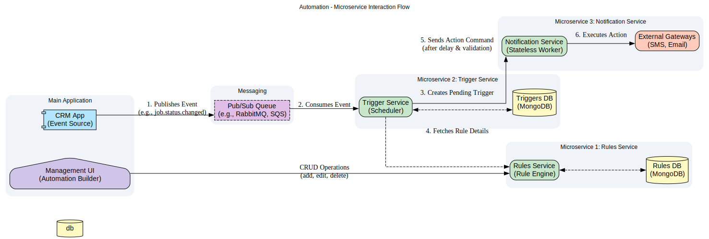
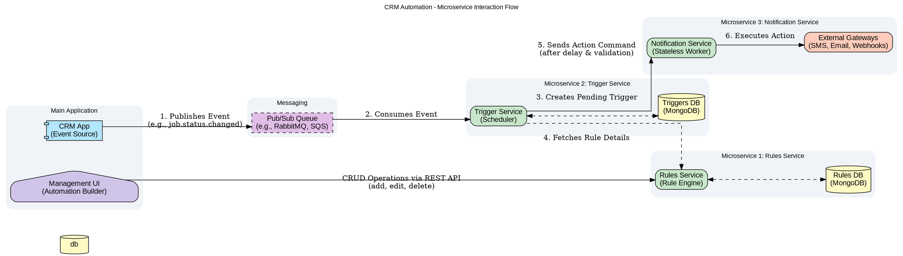

# CRM Automation Engine

This document outlines the architecture, data models, and workflow for the CRM Automation Engine. The system is designed as a set of decoupled microservices to handle the creation, scheduling, and execution of complex automation rules based on events within the main CRM application. Its core purpose is to provide a flexible, scalable, and reliable automation platform.

## System Architecture

The following diagram illustrates the flow of information between the main application and the various microservices that comprise the automation engine. The architecture is designed to be event-driven, ensuring loose coupling and high availability.

1. **CRM Automation Architecture**:  
	




---

## Microservice Breakdown

### 1. Rules Service (`microservice-rules`)

This service is the authoritative source for all automation logic. It uses `json-rules-engine` to define and store the automation rules. It exposes a REST API for the **Management UI** to perform CRUD operations on rules, ensuring that all business logic is centralized and managed independently.

#### Key Responsibilities:
* **CRUD API:** Provides endpoints (`POST /rules`, `GET /rules/:id`, `PUT /rules/:id`, `DELETE /rules/:id`) for managing rules.
* **Rule Validation:** Before saving, the service validates the structure of the rule, ensuring conditions are well-formed and actions are recognized.
* **Multi-tenancy:** Uses an `accountId` on every rule to ensure strict data isolation between different client accounts. All API queries are scoped by the authenticated account.

**MongoDB Collection: `rules`**

A document in this collection represents a complete, reusable automation rule. The `conditions` block is a direct input for the `json-rules-engine`.

**Example Document 1 (Simple):**
```json
{
  "_id": "ObjectId('64a5b8e8f1b2c3d4e5f6a7b1')",
  "name": "Notify Technician 5 Mins After Job Completion",
  "description": "Sends an SMS to the assigned technician 5 minutes after a job's status is changed to 'Done'.",
  "accountId": "acc_12345",
  "enabled": true,
  "trigger": { "eventName": "job.status.changed" },
  "delay": { "value": 5, "unit": "minutes" },
  "conditions": {
    "all": [
      { "fact": "job", "path": "$.status", "operator": "equal", "value": "Done" },
      { "fact": "job", "path": "$.assignedTechnician.phone", "operator": "notEqual", "value": null }
    ]
  },
  "actions": [
    {
      "type": "sms",
      "params": {
        "recipient": { "source": "fact", "fact": "job", "path": "$.assignedTechnician.phone" },
        "message": "Hi {{job.assignedTechnician.name}}, job #{{job.number}} for {{job.client.name}} has been completed."
      }
    }
  ],
  "createdAt": "2023-07-05T12:00:00Z",
  "updatedAt": "2023-07-05T12:00:00Z"
}
```

**Example Document 2 (Complex):**
This rule triggers immediately when a high-value job is created, sending both an email to a manager and posting a webhook to a sales CRM.
```json
{
  "_id": "ObjectId('99f8a7e7e6d5c4b3a2987654')",
  "name": "Alert on New High-Value Job",
  "description": "Notifies the regional manager and updates the CRM when a job over $2000 is created.",
  "accountId": "acc_12345",
  "enabled": true,
  "trigger": { "eventName": "job.created" },
  "delay": { "value": 0, "unit": "minutes" },
  "conditions": {
    "all": [
      { "fact": "job", "path": "$.total", "operator": "greaterThanInclusive", "value": 2000 },
      { "fact": "job", "path": "$.client.type", "operator": "equal", "value": "Commercial" }
    ]
  },
  "actions": [
    {
      "type": "email",
      "params": {
        "recipient": "manager@CRM.com",
        "subject": "New High-Value Job: #{{job.number}}",
        "templateId": "new-high-value-job-template"
      }
    },
    {
      "type": "webhook",
      "params": {
        "url": "[https://hooks.crm.com/new-lead](https://hooks.crm.com/new-lead)",
        "payload": {
          "source": "CRM Automation",
          "jobId": "{{job.id}}",
          "clientName": "{{job.client.name}}",
          "value": "{{job.total}}"
        }
      }
    }
  ],
  "createdAt": "2023-07-06T10:00:00Z",
  "updatedAt": "2023-07-06T10:00:00Z"
}
```

---

### 2. Trigger Service (`microservice-triggers`)

This service acts as the system's scheduler and orchestrator. It consumes events from the message queue, finds the relevant rules, and schedules them for future execution. It is stateful, maintaining a record of every triggered rule instance.

#### Key Responsibilities:
* **Event Consumption:** Listens to the pub/sub queue for incoming application events.
* **Rule Matching:** Upon receiving an event, it queries the **Rules Service** for all enabled rules matching the event name and `accountId`.
* **Scheduling:** For each matched rule, it creates a `pending_triggers` document with an `evaluateAt` timestamp, which is the current time plus the rule's specified delay.
* **Cron-based Execution:** A cron job runs every minute to find triggers that are due for evaluation.

**MongoDB Collection: `pending_triggers`**

This collection stores instances of rules that have been triggered and are awaiting execution. The document's `status` field tracks its lifecycle (`pending` -> `processing` -> `completed` / `failed`).

**Example Document:**
```json
{
  "_id": "ObjectId('75b6c9f9g2c3d4e5f6a7b2c2')",
  "ruleId": "ObjectId('64a5b8e8f1b2c3d4e5f6a7b1')",
  "accountId": "acc_12345",
  "status": "pending",
  "evaluateAt": "2025-07-06T21:47:00Z",
  "triggeringEvent": {
    "name": "job.status.changed",
    "timestamp": "2025-07-06T21:42:00Z",
    "payload": {
        "job": {
            "id": "job_abc123",
            "number": "J-5541",
            "status": "Done",
            "client": { "name": "John Smith" },
            "assignedTechnician": { "name": "Jane Doe", "phone": "+15557654321" }
        }
    }
  },
  "executionHistory": [],
  "createdAt": "2025-07-06T21:42:01Z"
}
```

**Cron Job Logic (Expanded):**

1.  **Query for Due Triggers:** `find({ status: { $in: ['pending', 'retrying'] }, evaluateAt: { $lte: new Date() } })`.
2.  **Lock Document:** For each result, perform an atomic update to set `status: 'processing'` and increment an `attempt` counter. This prevents other cron instances from picking up the same job.
3.  **Fetch Rule Details:** Call the **Rules Service** to get the full rule definition using `ruleId`.
4.  **Evaluate Conditions:** Execute the `json-rules-engine` with the rule's `conditions` and the `triggeringEvent.payload`.
5.  **Dispatch Actions:** If conditions pass, iterate through the `actions` array and send a distinct command to the **Notification Service** for each action.
6.  **Update Status:** On success, set `status: 'completed'`. If any step fails (e.g., notification service returns a non-recoverable error), set `status: 'failed'` and log the error in `executionHistory`. For transient errors, the status could be reset to `retrying` with an exponential backoff on `evaluateAt`.

---

### 3. Notification Service (`microservice-notifications`)

This is a simple, stateless "worker" service. Its only job is to receive explicit instructions and execute them by integrating with external gateways (e.g., Twilio for SMS, SendGrid for email, or generic HTTP clients for webhooks). Its statelessness makes it highly scalable and resilient.

#### Key Responsibilities:
* **Action Execution:** Exposes distinct API endpoints for each action type (e.g., `/api/v1/sms`, `/api/v1/email`, `/api/v1/webhook`).
* **Third-Party Integration:** Contains the logic for communicating with external service providers.
* **Idempotency:** Uses the `triggerId` passed in the metadata to de-duplicate requests, preventing the same notification from being sent twice if the Trigger Service retries a command.

**Example API Request Body (POST to `/api/v1/sms`)**
```json
{
  "recipient": "+15557654321",
  "message": "Hi Jane Doe, job #J-5541 for John Smith has been completed.",
  "metadata": {
    "source": "automation-engine",
    "ruleId": "64a5b8e8f1b2c3d4e5f6a7b1",
    "triggerId": "75b6c9f9g2c3d4e5f6a7b2c2",
    "accountId": "acc_12345"
  }
}
```

## Inter-service Communication Patterns

While direct REST API calls are simple, choosing the right pattern is key to building a robust system.

### Option 1: Synchronous REST API

**How it works:** The `Trigger Service` makes a direct, blocking HTTP request to the `Rules Service` to fetch rule details.

**Pros:**
*   Simple to implement and debug.
*   Provides immediate success/failure feedback.

**Cons:**
*   Creates tight coupling. If the `Rules Service` is down or slow, the `Trigger Service` is directly impacted, potentially blocking its main processing loop.

### Option 2: Synchronous RPC with gRPC & Protobuf

**How it works:** Services define a strict contract using a `.proto` file (Protocol Buffers). This contract specifies the available procedures (RPCs) and message structures. Communication happens over HTTP/2, and data is serialized into a compact binary format.

**Pros:**
*   **High Performance:** Binary serialization and use of HTTP/2 make it significantly faster than JSON-based REST.
*   **Strict Contracts:** The `.proto` file acts as a clear, enforceable API contract. Client libraries can be auto-generated, reducing boilerplate code.
*   **Streaming:** `gRPC` natively supports bi-directional streaming, which is powerful for more complex, long-lived interactions.

**Cons:**
*   **Less Human-Readable:** The binary format is not easily inspectable without tooling.
*   **Tooling/Ecosystem:** While strong, the ecosystem is not as universally supported in browsers or simple command-line tools like `curl` compared to REST.

### Option 3: Asynchronous Pub/Sub via Message Bus (Recommended for High Throughput)

**How it works:** Instead of direct calls, services communicate by publishing events to and consuming events from a central message bus (like `RabbitMQ`, `Kafka`, or `Google Pub/Sub`).

**Example Flow:**

1.  The `Trigger Service` consumes `job.created` and publishes a new event, `rule_lookup_requested`, containing the original event details.
2.  The `Rules Service` subscribes to `rule_lookup_requested` events. When it receives one, it finds all matching rules.
3.  The `Rules Service` then publishes a `rules_found` event containing the rule definitions and the original event payload.
4.  The `Trigger Service` subscribes to `rules_found` and proceeds to create the `pending_triggers` documents.

**Pros:**
*   **Decoupling:** Services don't need to know each other's network locations, only the address of the message bus.
*   **Resilience:** If the `Rules Service` is temporarily unavailable, the `rule_lookup_requested` events queue up in the message bus and are processed once the service recovers.
*   **Scalability:** You can add more instances of the `Rules Service` to process lookup requests in parallel without changing the `Trigger Service`.

**Cons:**
*   **Increased Complexity:** Requires managing a message bus and dealing with concepts like eventual consistency.
*   **Harder to Debug:** Tracing a single request across multiple asynchronous events can be more challenging without proper distributed tracing tools.

This hybrid approach allows for a highly resilient core workflow while maintaining simplicity for less critical paths like the `Management UI`.


---

## Operational Considerations

### Error Handling & Monitoring
* **Centralized Logging:** All services should log to a centralized platform (e.g., Datadog, ELK Stack). Logs must include the `ruleId`, `triggerId`, and `accountId` for easy tracing across the distributed system.
* **Alerting:** Critical alerts should be configured for:
    * A high rate of `failed` triggers.
    * Message queue depth exceeding a certain threshold.
    * API error rates (4xx/5xx) on any service.
* **Dead Letter Queue (DLQ):** The main message queue should have a DLQ to capture events that the Trigger Service fails to consume after several retries, allowing for manual inspection and replay.

### Scalability & Performance
* **Independent Scaling:** Each microservice can be scaled horizontally based on its specific load. For example, the Notification Service might need more instances during peak business hours.
* **Database Indexing:** The `rules` collection in MongoDB should be indexed on `accountId` and `trigger.eventName`. The `pending_triggers` collection requires a compound index on `status` and `evaluateAt` for efficient cron job queries.
* **Asynchronous Processing:** The use of a message queue is fundamental to the system's ability to handle bursts of events without overwhelming the services.

### Security
* **API Authentication:** The Rules Service API must be protected and require authentication to identify the user and their `accountId`.
* **Inter-service Communication:** Communication between services should be secured, for instance, within a private network (VPC) or using mTLS.
* **Data Sanitization:** All user-defined content, especially webhook URLs and message templates, must be sanitized to prevent injection attacks (e.g., SSRF in webhooks).
