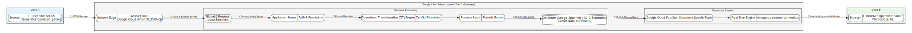
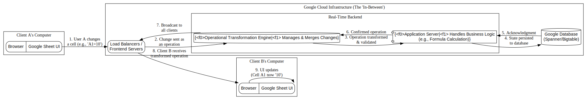

# Google Sheets: A Deep Dive into the Client-to-Client Architectural Flow

This document deconstructs the underlying architecture that enables real-time, multi-user collaboration in Google Sheets. It illustrates the technological stack that exists "in-between" two clients, demonstrating how a simple cell change by one user is propagated to another.

The core principle is that clients are completely decoupled and never communicate directly. All interactions are mediated, synchronized, and broadcasted by Google's globally distributed cloud infrastructure.

## The Journey of a Single Keystroke

Let's trace the lifecycle of a single data change: **Client A** types the value `123` into cell `C5`. **Client B**, who has the same sheet open, sees this change appear in near real-time.

1. **Google Sheets Architecture**:  
    

2. **Google Sheets Architecture (from another angle)**:  
    

## End-to-End Flow
2. **The Client-Side Event**:   - Client A's browser captures the keystroke event.
   - The application generates a minimal operation (or "delta") representing the change.
   - This operation is sent to Google's servers via an HTTPS request.   
3. **The Network Edge**:  
    - The request reaches Google's edge network, where it is processed and secured.
    - The request is routed to the appropriate data center and service.
4. **The Backend Processing**:
    - The request is authenticated and processed by the application server.
    - The Operational Transformation (OT) engine manages concurrency and applies the change.
    - Any dependent calculations (like formulas) are updated server-side.
5. **The Persistence Layer**:
    - The changes are committed to a globally distributed database, ensuring high availability and durability.
6. **Broadcasting the Change**:
    - The application server publishes the change to a Pub/Sub topic.
    - The real-time engine pushes the change to all connected clients.
7. **Client B's Update**:
    - Client B's browser receives the change and updates its local view of the document.
    - The change appears in near real-time, creating a seamless collaborative experience.

### 1. Client A: The Initial Event & Egress

*   **Browser (The Thin Client):** The Google Sheets JavaScript application running in Client A's browser captures the `onkeyup` or `onchange` event.
*   **Operation Creation:** The application doesn't send the entire sheet. Instead, it generates a tiny, descriptive data packet called an **operation** (or "delta"). For this change, the operation is conceptually simple: `[{"op": "edit", "cell": "C5", "value": "123"}]`.
*   **HTTPS Request:** This operation is wrapped in an HTTPS request and sent from the browser, destined for Google's servers.

### 2. The Network Edge: Reaching Google's Front Door

*   **DNS Resolution:** Client A's browser performs a DNS lookup for `docs.google.com`. Google uses **Anycast DNS**, meaning the IP address returned is for the nearest Google Edge Point of Presence (PoP) to Client A, ensuring the lowest possible latency.
*   **Google's Edge Network:** The request travels over the public internet to this Edge PoP. This is Google's private, high-speed fiber network, which significantly speeds up the rest of the data's journey.
*   **TLS Termination & DDoS Protection:** At the edge, Google's infrastructure (e.g., `Google Cloud Armor`) handles DDoS mitigation. The encrypted TLS/SSL connection is terminated here, and the request is inspected before being allowed onto Google's internal network.

### 3. Google Cloud: The Central Nervous System

The request, now securely inside Google's network, is routed to the appropriate data center and service.

#### A. The Frontend & Load Balancing

*   **Global Load Balancer:** The request first hits a global load balancer, which directs traffic to a specific region (e.g., `us-central1`).
*   **Regional Load Balancer:** Within that region, a regional load balancer distributes the request across a fleet of stateless frontend servers. This ensures high availability and scalability.

#### B. The Real-Time Backend: Synchronization & Logic

This is the core of the collaborative engine.

*   **Application Server:** The request is received by an application server. Its first job is to authenticate the user's session and verify permissions (i.e., does Client A have write access to this sheet?).
*   **Operational Transformation (OT) Engine:** The operation `[edit C5 to "123"]` is passed to the OT Engine. This is the critical component for concurrency control.
    *   The OT Engine's job is to manage conflicts. If Client B was simultaneously changing the same cell, the OT engine would receive both operations and transform them based on vector clocks or timestamps to create a final, consistent state that can be applied logically, preventing a race condition.
*   **Business Logic Execution:** The application server now processes any related logic. If cell `D5` contains the formula `=C5*2`, the server calculates the new result (`246`) and generates a second internal operation: `[{"op": "update", "cell": "D5", "value": "246"}]`. This happens server-side to ensure all users see the same calculated result.

#### C. The Persistence Layer: The Source of Truth

*   **Database Transaction:** The validated and transformed operations (`edit C5`, `update D5`) are committed to Google's underlying database. This is not a simple SQL database but a globally distributed, ACID-compliant database like `Google Spanner`.
*   **High Availability & Durability:** `Spanner` ensures the data is synchronously replicated across multiple servers and even data centers. This guarantees that once the change is saved, it is durable and will survive server or even regional failures. The document's revision history is also updated in this transaction.

### 4. The Broadcast: Pushing the State to All Clients

Once the change is successfully committed to the database, the system must notify all other connected clients.

*   **Pub/Sub & Push Notifications:** The application server publishes the confirmed operations to a Publish/Subscribe (`Pub/Sub`) topic associated with this specific document.
*   **The Real-Time Engine** acts as a subscriber to this topic. It maintains a list of all active sessions (like Client B's) for the document.
*   **Push to Clients:** The engine pushes the operations (`edit C5`, `update D5`) down the persistent connection it holds with Client B's browser (a `WebSocket` or similar long-polling mechanism).

### 5. Client B: The Final State & Ingress

*   **Receiving the Operation:** Client B's browser receives the incoming operations from Google's server.
*   **Applying the Patch:** The Google Sheets JavaScript application on Client B's side doesn't need to know why the change happened. It simply follows the instructions in the operation packet and updates its local view of the DOM. Cell `C5`'s content is changed to `123`, and cell `D5` is changed to `246`.

The entire round trip, from Client A's keystroke to Client B's screen update, happens in milliseconds, creating the illusion of a shared, living document.