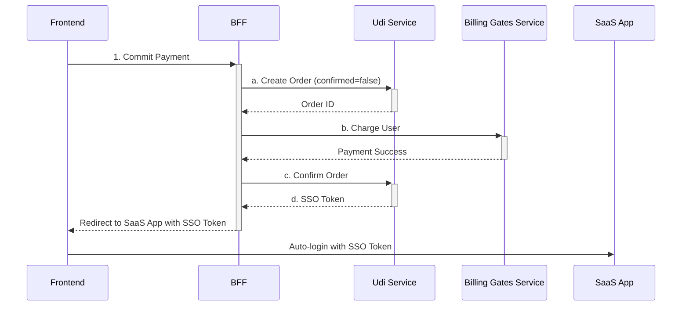
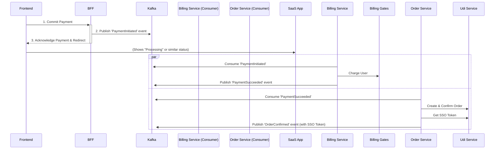

# Payment Flow Architecture

This document outlines the current payment processing flow, its drawbacks, and a proposed improved architecture using a message queue.

## Current Flow

The current implementation uses a synchronous, blocking flow managed by a BFF (Backend for Frontend).

### Sequence Diagram

## Drawbacks of the Current Method

The current synchronous approach presents several critical issues:

- **Poor User Experience 😫:** The user is blocked and must wait for all four backend steps to complete. Any service delay results in a slow and frustrating experience.

- **High Coupling:** The BFF is tightly coupled to the Udi and Billing services. If either service fails or is slow, the entire payment process fails, making the system brittle.

- **Lack of Fault Tolerance:** The system can be left in an inconsistent state if any step fails. For example, a user could be charged without having their order confirmed, requiring complex manual recovery.

- **Scalability Issues:** The synchronous, long-running requests make the BFF a bottleneck, limiting the system's ability to handle a high volume of concurrent payments.

## Improved Flow using a Message Queue (Kafka)

By adopting an asynchronous, event-driven architecture, we can decouple our services, improve user experience, and increase resilience.

### Sequence Diagram

## Advantages of the Improved Method

The proposed event-driven architecture offers significant benefits:

- **Improved User Experience ✨:** The user gets an immediate response from the BFF. They are no longer forced to wait and can be redirected to a page showing the "processing" status.

- **Increased Resilience:** If a downstream service (like Billing) is down, the event remains in the Kafka queue to be processed when the service recovers. This prevents data loss and inconsistent states.

- **Enhanced Scalability:** Each service can be scaled independently based on load. If payment processing is slow, you can add more Billing Service consumers without touching the BFF or other parts of the system.

- **Loose Coupling:** The BFF's only responsibility is to publish an event. It doesn't need to know about the complex orchestration of billing and order confirmation, making the system more modular and easier to maintain.